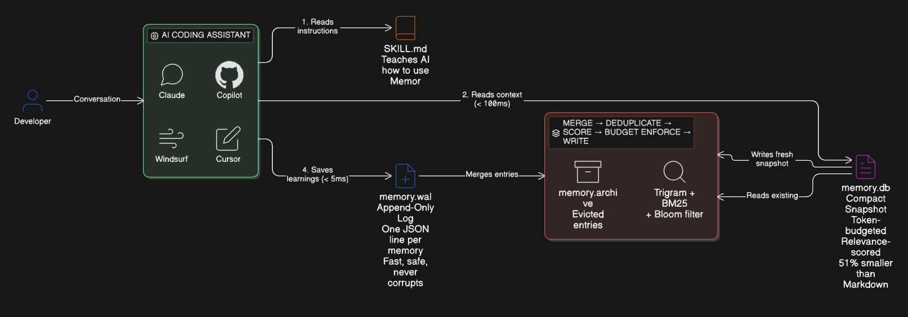

<p align="center">
  
</p>

<h1 align="center">Memor</h1>

<p align="center">
  <strong>Local memory persistence for AI coding assistants.</strong>
</p>

<p align="center">
  <a href="https://github.com/akashchekka/memor/releases"></a>
  <a href="https://github.com/akashchekka/memor/actions/workflows/release.yml"></a>
  <a href="https://www.npmjs.com/package/@memor-dev/memor"></a>
  <a href="https://github.com/akashchekka/memor/blob/main/LICENSE"></a>
  <a href="https://goreportcard.com/report/github.com/akashchekka/memor"></a>
</p>

<p align="center">
  Every AI coding tool — Copilot, Claude Code, Cursor, Windsurf, Aider — starts every conversation cold, with zero knowledge of past decisions. Memor fixes that. It stores project context locally, indexes it with a full search engine, and gives every tool exactly the right memories within a token budget at conversation start.
</p>

<p align="center">
  <em>Five text files per project. Full indexing engine. Zero cloud, zero daemon, zero git commits.</em>
</p>

---

## Why

| Problem | Without Memor |
|---|---|
| Repeated explanations every session | Wasted developer time |
| Redundant token consumption | Wasted compute and money |
| Inconsistent outputs across sessions | Bugs and conflicting patterns |
| Manual context pasting | Context window pollution |

Memor saves **~500 tokens per conversation** by surfacing only what's relevant. At scale, that's **100 billion tokens/month** across 1M developers.

---

## How It Works

- **Write path**: AI tools append memories as JSONL lines to `memory.wal` — fast, append-only, no coordination.
- **Read path**: `memor context` retrieves the most relevant memories + knowledge sections within a token budget — powered by trigram index + BM25 ranking for sub-millisecond retrieval.
- **Compaction**: Periodically merges the WAL into `memory.db`, deduplicates via SHA-256 content hashing, scores by relevance, and enforces the token budget.

---

## Quick Start

### Install

```bash
# npm (recommended)
npm i -g @memor-dev/memor

# or use directly without installing
npx @memor-dev/memor init
```

### Initialize in your project

```bash
cd your-project
memor init
```

This creates `.memor/`, injects `copilot-instructions.md` and `.github/skills/memor/SKILL.md` so your AI tool automatically reads and writes memories, installs a pre-commit safety hook, and adds `.memor/` to `.gitignore`. No extra setup needed.

Use `memor init --tools claude,cursor,windsurf` to configure additional AI tools.

### Add a memory

```bash
memor add --type semantic --tags "arch,db" "PostgreSQL 16 with Drizzle ORM"

# Or use shorthand:
memor add -s "#arch #db: PostgreSQL 16 with Drizzle ORM"
```

### Get context for a conversation

```bash
memor context --budget 10000 --query "deploy api"
```

Returns a packed block of relevant memories and knowledge sections, ready for injection into any AI tool's context window.

### Search memories

```bash
memor search "deploy"
memor query --tags "auth,api"
```

---

## On-Disk Layout

```
<project>/
├── .memor/                       # Per-project memory (gitignored)
│   ├── memory.db                 # Token-optimized snapshot (compact DSL)
│   ├── memory.wal                # JSONL append-only write log
│   ├── memory.archive            # Evicted entries (cold storage)
│   ├── knowledge.db              # Indexed skills & instructions
│   ├── config.toml               # Configuration
│   └── index/                    # Derived indexes (regeneratable)
│       ├── trigrams.bin
│       ├── tags.json
│       ├── bloom.bin
│       └── recency.json
└── .gitignore
```

**Total active footprint: < 200 KB per project.**

---

## Memory Types

| Prefix | Type | Use For |
|---|---|---|
| `@s` | Semantic | Facts, decisions, architecture choices |
| `@e` | Episodic | Events, bugs fixed, migrations completed |
| `@p` | Procedural | Commands, workflows, how-tos |
| `@f` | Preference | Developer style preferences (permanent) |
| `@c` | Code | Structured file summaries (exports, deps, logic) |

### Snapshot format (`memory.db`)

```
@mem v1 | 24 entries | budget:15000 | compacted:2026-04-22T10:00:00Z

@s #arch: pnpm workspaces + Turborepo monorepo [2026-01-15]
@s #auth #decision: OAuth2+PKCE via Auth0 [2026-03-10]
@p #deploy: pnpm turbo deploy --filter=@app/api [2026-03-01]
@e #perf #db: Fixed N+1 in dashboard loader [2026-04-20]
@f #typescript: No any, use unknown + type guards [perm]
@c src/lib/auth.ts [187 LOC | a3f9c2]
  exports: refreshToken(), validateSession(), revokeSession()
  deps: src/lib/redis.ts, src/config/env.ts
  summary: Auth middleware — JWT access tokens, refresh rotation
```

~51% fewer tokens than equivalent Markdown.

### WAL format (`memory.wal`)

```jsonl
{"t":1713800000,"y":"s","id":"0a3f9c2b1e7d","tags":["auth","api"],"c":"OAuth2+PKCE via Auth0"}
{"t":1713800100,"y":"e","tags":["testing"],"c":"Flaky auth test — race in token refresh mock"}
```

---

## CLI Reference

| Command | Description |
|---|---|
| `memor init` | Initialize `.memor/` in the current project, set up hooks and skill files |
| `memor add` | Append a new memory to the WAL |
| `memor context` | Get relevant context within a token budget (the main agent entry point) |
| `memor search <query>` | Full-text search memories by keyword (trigram + BM25) |
| `memor query --tags <t>` | Filter memories by tags |
| `memor compact` | Merge WAL into `memory.db` snapshot |
| `memor stats` | Show entry counts, token usage, and index health |
| `memor reinforce <id>` | Bump relevance of a useful memory |
| `memor rebuild` | Rebuild all indexes from WAL + archive |
| `memor code save <file>` | Save a structured code file summary (exports, deps, summary, logic) |
| `memor code load [file]` | Load code summaries by path or `--query`, shows fresh/stale/missing |
| `memor code list` | List all mapped code files |
| `memor export` | Export memories as portable JSONL (auto-compacts first) |
| `memor import <file>` | Import memories from JSONL with `--skip-duplicates`, `--dry-run` |
| `memor knowledge add <file>` | Index a document into the knowledge base |
| `memor knowledge scan` | Auto-discover and index known file patterns |
| `memor knowledge refresh` | Re-index changed files |
| `memor knowledge list` | Show indexed documents and sections |
| `memor clean` | Reset all memory data, preserve `.memor/` directory and config |
| `memor purge` | Remove all memor files from the project |

---

## Indexing Engine

Memor combines well-known algorithms for sub-millisecond retrieval without embeddings, vector databases, or network calls:

- **Trigram inverted index** — decomposes content into 3-character substrings for fast candidate matching (same approach as Google Code Search)
- **BM25 ranking** — probabilistic relevance scoring with TF-IDF, used by Elasticsearch and Lucene
- **Bloom filter** — instant negative lookups at 1% false-positive rate (~12 KB for 10K entries)
- **Recency ring** — LRU buffer that boosts recently accessed memories
- **Content-addressed dedup** — SHA-256 hashing ensures identical facts produce one entry regardless of source

---

## AI Tool Integration

Memor is tool-agnostic. `memor init` copies the memor SKILL.md into each tool's skills directory:

| Tool | Skill Location |
|---|---|
| GitHub Copilot | `.github/skills/memor/SKILL.md` |
| Claude Code | `.claude/skills/memor/SKILL.md` |
| Cursor | `.cursor/skills/memor/SKILL.md` |
| Windsurf | `.windsurf/skills/memor/SKILL.md` |

By default, only the Copilot skill is created. Use `memor init --tools claude,cursor,windsurf` to create skills for other tools.

At conversation start, the AI tool reads `.memor/memory.db` for project context. After every response, it saves memories using `memor add`.

---

## Configuration

`.memor/config.toml` — all settings have sane defaults:

```toml
[memory]
token_budget = 15000         # Max tokens for memory.db
wal_max_entries = 100        # Auto-compact threshold

[ranking]
recency_weight = 0.3         # Freshness boost
bm25_k1 = 1.2                # Term frequency saturation
bm25_b = 0.75                # Length normalization
```

---

## Design Principles

1. **Local-first, no infrastructure** — just files on disk
2. **Text-first agent interface** — plain UTF-8, readable by any AI tool
3. **Full indexing engine** — trigram + BM25 + Bloom for sub-ms retrieval
4. **Token-budget-aware** — never exceeds the configured budget
5. **Tool-agnostic** — works with any AI coding assistant
6. **Append-only writes, compacted reads** — LSM-tree inspired architecture
7. **Zero-config start** — `memor init` and done

---

## Contributing

Contributions are welcome! Memor is written in Go 1.23+.

### Setup

```bash
git clone https://github.com/akashchekka/memor.git
cd memor
go build -o memor
```

### Run tests

```bash
go test ./...
```

### Project structure

```
main.go              # Entry point
cmd/                 # CLI commands (cobra)
  skill/             # Embedded SKILL.md template
internal/
  config/            # config.toml parsing
  constants/         # Centralized constants
  engine/            # Compaction, context retrieval, knowledge indexing
  index/             # Trigram, BM25, Bloom filter, recency ring
  memory/            # Memory entry types (including CodeMeta)
  store/             # WAL, snapshot, paths
  token/             # Token counting
```

### Guidelines

- Keep the CLI fast — every command should complete in under 100ms
- No external services or network calls
- Run `go test ./...` before submitting a PR
- Follow existing code style (no linter config needed, just match what's there)

---

## Tech Stack

- **Go 1.23** — single static binary, no runtime dependencies
- **Cobra** — CLI framework
- **Bloom filter** — `bits-and-blooms/bloom`
- **TOML** — `pelletier/go-toml`

---

## Security & Privacy

- All data stays local — no cloud, no telemetry, no network calls
- `.memor/` is gitignored by default — never committed
- Pre-commit hook prevents accidental commits of `.memor/`
- Never store secrets, API keys, passwords, or PII in memories

---

## License

See [LICENSE](LICENSE) for details.
